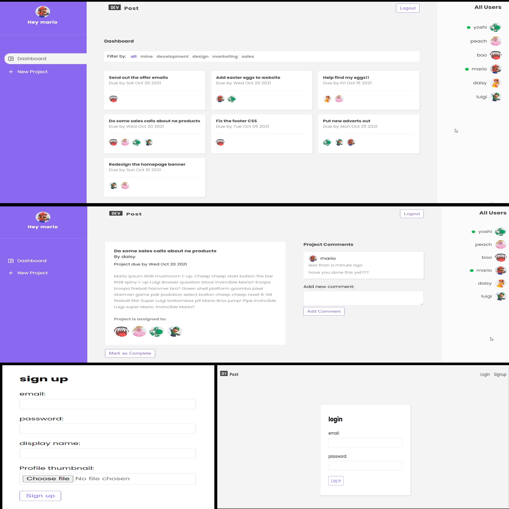

# DevPost App
[Live](https://project-tracker-152c8.web.app/login)

## This is preview

## DevPost

Dev Post is a project management web application built using React and Firebase. It allows users to create and manage projects, assign tasks, and collaborate efficiently within teams. The application leverages Firebase for backend services, including authentication, Firestore database, and storage, providing real-time data updates and secure user management. Key features include task tracking, user authentication, dynamic project creation, and progress monitoring, making it a streamlined solution for managing team projects in a modern web development environment. The clean, intuitive user interface ensures ease of use and productivity for all users.

